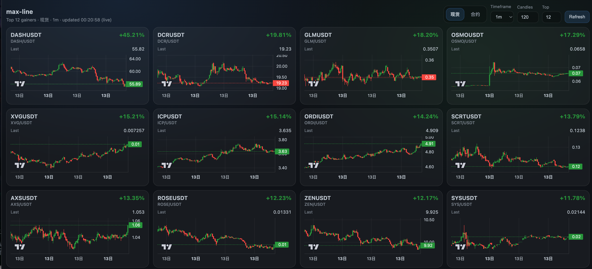
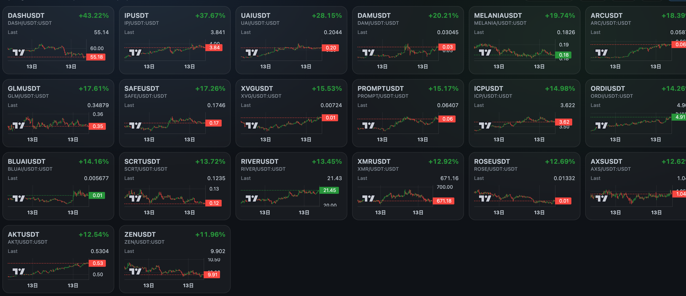

# max-line


> 实时加密货币市场涨幅追踪平台 | Real-time cryptocurrency market gainers tracker

max-line 是一个高性能的实时加密货币涨幅追踪仪表盘，专注于展示现货和永续合约市场中涨幅领先的币种。通过 CCXT 集成多个交易所数据，提供实时 K 线图可视化。

---

## ✨ 特性

- 🚀 **实时数据**: 通过 CCXT 集成多个主流交易所，获取实时市场数据
- 📊 **双市场支持**: 同时支持现货（Spot）和永续合约（Swap）市场
- 🎯 **智能排序**: 实时计算涨幅，自动展示表现最佳币种
- 📈 **K 线可视化**: 使用 lightweight-charts 提供专业的蜡烛图展示
- ⚡ **高性能**: 异步架构 + 内置缓存，优化响应速度
- 🔄 **自动刷新**: 可配置的自动刷新机制，保持数据最新
- 🎨 **响应式设计**: 自适应布局，支持桌面和移动端
- 🔒 **类型安全**: 后端 Python 类型提示 + 前端 TypeScript 严格模式







---

## 📋 目录

- [快速开始](#快速开始)
- [安装指南](#安装指南)
- [配置说明](#配置说明)
- [使用方法](#使用方法)
- [API 文档](#api-文档)
- [开发指南](#开发指南)
- [架构设计](#架构设计)
- [部署指南](#部署指南)
- [常见问题](#常见问题)
- [贡献指南](#贡献指南)
- [许可证](#许可证)

---

## 🚀 快速开始

### 使用 Docker（推荐）

```bash
# 克隆仓库
git clone https://github.com/yourusername/max-line.git
cd max-line

# 复制环境变量文件
cp .env.example .env

# 使用 Docker Compose 启动
docker-compose up -d

# 访问应用
# Frontend: http://localhost:5173
# Backend API: http://localhost:8010
```

### 本地开发

#### 前置要求

- Python 3.8+
- Node.js 18+
- npm 或 yarn

#### 后端

```bash
# 创建虚拟环境
python -m venv .venv
source .venv/bin/activate  # Windows: .venv\Scripts\activate

# 安装依赖
pip install -r backend/requirements.txt

# 启动开发服务器
uvicorn app.main:app --reload --app-dir backend --host 0.0.0.0 --port 8010

# 或使用 Makefile
make dev-backend
```

#### 前端

```bash
# 进入前端目录
cd frontend

# 安装依赖
npm install

# 启动开发服务器
npm run dev

# 或使用 Makefile（从根目录）
make dev-frontend
```

访问 `http://localhost:5173` 查看应用。

---

## 📦 安装指南

### 系统要求

| 组件 | 最低版本 | 推荐版本 |
|------|----------|----------|
| Python | 3.8 | 3.10+ |
| Node.js | 18.0 | 20+ |
| npm | 9.0 | 10+ |

### 依赖安装

#### 后端依赖

```bash
# 激活虚拟环境
source .venv/bin/activate

# 安装后端依赖
pip install -r backend/requirements.txt
```

主要依赖：
- **FastAPI** 0.115.6 - 现代 Web 框架
- **CCXT** 4.5.30 - 交易所集成库
- **Pydantic Settings** - 配置管理
- **cachetools** - 缓存工具

#### 前端依赖

```bash
# 进入前端目录
cd frontend

# 安装前端依赖
npm install
```

主要依赖：
- **React** 18.3.1 - UI 框架
- **TypeScript** 5.6.3 - 类型系统
- **Vite** 5.4.10 - 构建工具
- **lightweight-charts** 4.2.0 - 图表库

---

## ⚙️ 配置说明

### 环境变量

复制示例配置文件并根据需求修改：

```bash
cp .env.example .env
```

#### 配置项说明

| 变量名 | 说明 | 默认值 |
|--------|------|--------|
| `MAXLINE_EXCHANGE` | 交易所名称 | `binance` |
| `MAXLINE_MARKET` | 市场类型 | `spot` |
| `MAXLINE_QUOTE` | 计价货币 | `USDT` |
| `MAXLINE_TIMEFRAME` | K 线周期 | `1m` |
| `MAXLINE_LIMIT` | K 线数量 | `120` |
| `MAXLINE_TOP` | 展示数量 | `12` |
| `MAXLINE_CACHE_TTL_SECONDS` | 缓存 TTL | `20` |
| `MAXLINE_AUTO_REFRESH` | 自动刷新 | `true` |
| `MAXLINE_REFRESH_INTERVAL_SECONDS` | 刷新间隔 | `30` |
| `MAXLINE_CORS_ORIGINS` | CORS 源 | `http://localhost:5173` |
| `MAXLINE_PROXY_URL` | 代理 URL | 空 |

### 前端配置

前端配置位于 `frontend/vite.config.ts`：

```typescript
export default defineConfig({
  server: {
    proxy: {
      "/api": {
        target: process.env.VITE_API_TARGET ?? "http://localhost:8010",
        changeOrigin: true
      }
    }
  }
});
```

---

## 🎯 使用方法

### 基本使用

1. **启动应用**

```bash
# 后端
uvicorn app.main:app --reload --app-dir backend --port 8010

# 前端（新终端）
cd frontend && npm run dev
```

2. **访问界面**

打开浏览器访问 `http://localhost:5173`

3. **界面操作**

- **市场切换**: 点击 "现货" / "合约" 切换市场类型
- **时间周期**: 选择 K 线周期（1m, 5m, 15m, 1h, 4h, 1d）
- **蜡烛数量**: 调整 K 线显示数量（20-300）
- **展示数量**: 设置展示币种数量（1-24）
- **刷新**: 手动刷新数据

### 高级功能

#### 强制刷新缓存

```bash
# 通过 API
curl "http://localhost:8010/api/top-gainers?force=true"

# 通过界面点击刷新按钮
```

#### 代理配置

如果需要通过代理访问交易所 API：

```bash
# 方式 1: 环境变量
export MAXLINE_PROXY_URL=http://127.0.0.1:7890

# 方式 2: 系统代理
export HTTPS_PROXY=http://127.0.0.1:7890
export HTTP_PROXY=http://127.0.0.1:7890
```

---

## 📚 API 文档

### 健康检查

```http
GET /api/health
```

**响应示例**

```json
{
  "status": "ok"
}
```

### 获取涨幅榜单

```http
GET /api/top-gainers?exchange=binance&market=spot&quote=USDT&timeframe=1m&limit=120&top=12&force=false
```

#### 请求参数

| 参数 | 类型 | 必填 | 说明 |
|------|------|------|------|
| `exchange` | string | 否 | 交易所名称（默认：`binance`）|
| `market` | string | 否 | 市场类型：`spot` 或 `swap`（默认：`spot`）|
| `quote` | string | 否 | 计价货币（默认：`USDT`）|
| `timeframe` | string | 否 | K 线周期（默认：`1m`）|
| `limit` | integer | 否 | K 线数量 2-1000（默认：`120`）|
| `top` | integer | 否 | 展示数量 1-50（默认：`12`）|
| `force` | boolean | 否 | 强制刷新缓存（默认：`false`）|

#### 响应示例

```json
{
  "exchange": "binance",
  "market": "spot",
  "quote": "USDT",
  "timeframe": "1m",
  "limit": 120,
  "top": 12,
  "updated_at": "2026-01-14T00:06:00.123456+00:00",
  "source": "live",
  "items": [
    {
      "symbol": "BTC/USDT",
      "market_id": "BTCUSDT",
      "base": "BTC",
      "quote": "USDT",
      "last": 95000.5,
      "change_pct": 5.23,
      "ohlcv": [
        [1736808000000, 90200.5, 95100.0, 90000.0, 95000.5, 12345.67],
        ...
      ],
      "meta": {}
    }
  ]
}
```

### 交互式文档

启动后端后访问以下地址查看完整的 API 文档：

- Swagger UI: `http://localhost:8010/docs`
- ReDoc: `http://localhost:8010/redoc`

---

## 🛠️ 开发指南

### 项目结构

```
max-line/
├── backend/                    # FastAPI 后端
│   ├── app/
│   │   ├── main.py            # FastAPI 应用入口
│   │   ├── models.py          # Pydantic 数据模型
│   │   ├── settings.py        # 配置管理
│   │   └── services/
│   │       └── market_data.py # 市场数据服务
│   └── requirements.txt        # Python 依赖
├── frontend/                   # React 前端
│   ├── src/
│   │   ├── api.ts             # API 客户端
│   │   ├── App.tsx            # 主组件
│   │   ├── main.tsx           # 入口文件
│   │   ├── styles.css          # 全局样式
│   │   └── components/
│   │       ├── CoinCard.tsx   # 币种卡片
│   │       └── CandleChart.tsx # K 线图
│   ├── package.json           # Node 依赖
│   ├── tsconfig.json          # TypeScript 配置
│   └── vite.config.ts         # Vite 配置
├── Makefile                   # 快捷命令
├── docker-compose.yml         # Docker Compose 配置
├── .env.example              # 环境变量示例
└── README.md                 # 项目文档
```

### 代码规范

#### Python 后端

- 遵循 PEP 8 代码风格
- 使用 `from __future__ import annotations` 启用现代类型提示
- 所有 I/O 操作必须使用 async/await
- 类型注解使用 PEP 604 语法（`str | None` 而非 `Optional[str]`）
- 使用 Pydantic BaseModel 进行数据验证

```python
from __future__ import annotations
from typing import Any
import ccxt.async_support as ccxt
from fastapi import FastAPI, HTTPException
from pydantic import BaseModel, Field

class TopGainerItem(BaseModel):
    symbol: str
    change_pct: float = Field(..., description="Percent change")
    meta: dict[str, Any] = Field(default_factory=dict)
```

#### TypeScript 前端

- 使用 TypeScript 严格模式
- 优先使用函数组件 + Hooks
- 类型注解使用 `type` 别名（而非 `interface`）
- 使用语义化 HTML 和 CSS 类名

```typescript
export type TopGainerItem = {
  symbol: string;
  change_pct: number;
  ohlcv: OhlcvRow[];
};

export default function App() {
  const [data, setData] = useState<TopGainersResponse | null>(null);
  useEffect(() => {
    // ...
  }, [deps]);
  return <div>...</div>;
}
```

### Makefile 命令

```bash
make dev-backend    # 启动后端开发服务器
make dev-frontend   # 启动前端开发服务器
```

### 构建生产版本

```bash
# 前端构建
cd frontend
npm run build

# 后端生产部署
uvicorn app.main:app --app-dir backend --host 0.0.0.0 --port 8010
```

---

## 🏗️ 架构设计

### 技术栈

#### 后端

| 技术 | 版本 | 用途 |
|------|------|------|
| FastAPI | 0.115.6 | Web 框架 |
| CCXT | 4.5.30 | 交易所集成 |
| Pydantic | - | 数据验证 |
| Uvicorn | - | ASGI 服务器 |
| cachetools | - | 缓存实现 |

#### 前端

| 技术 | 版本 | 用途 |
|------|------|------|
| React | 18.3.1 | UI 框架 |
| TypeScript | 5.6.3 | 类型系统 |
| Vite | 5.4.10 | 构建工具 |
| lightweight-charts | 4.2.0 | 图表库 |

### 数据流

```
┌─────────────┐
│   React UI  │
│  (Frontend) │
└──────┬──────┘
       │ HTTP API
       ▼
┌─────────────┐
│   FastAPI   │
│  (Backend)  │
└──────┬──────┘
       │ CCXT
       ▼
┌─────────────┐
│  Exchange   │
│   (Binance) │
└─────────────┘
```

### 缓存策略

- **内存缓存**: 使用 `asyncio.Lock` 保证线程安全
- **TTL 机制**: 可配置的缓存过期时间
- **降级策略**: 请求失败时返回缓存数据

---

## 🚢 部署指南

### Docker 部署

```bash
# 构建镜像
docker-compose build

# 启动服务
docker-compose up -d

# 查看日志
docker-compose logs -f

# 停止服务
docker-compose down
```

### 环境变量配置

在生产环境中，建议通过环境变量配置所有参数：

```bash
# 后端
export MAXLINE_EXCHANGE=binance
export MAXLINE_MARKET=spot
export MAXLINE_QUOTE=USDT
export MAXLINE_CACHE_TTL_SECONDS=60
export MAXLINE_AUTO_REFRESH=true
export MAXLINE_REFRESH_INTERVAL_SECONDS=60
export MAXLINE_CORS_ORIGINS=https://yourdomain.com
export MAXLINE_PROXY_URL=https://your-proxy.com

# 前端
export VITE_API_TARGET=https://api.yourdomain.com
```

### 反向代理配置（Nginx）

```nginx
server {
    listen 80;
    server_name yourdomain.com;

    # 前端
    location / {
        root /var/www/max-line/frontend/dist;
        try_files $uri $uri/ /index.html;
    }

    # 后端 API
    location /api {
        proxy_pass http://localhost:8010;
        proxy_set_header Host $host;
        proxy_set_header X-Real-IP $remote_addr;
    }
}
```

---

## ❓ 常见问题

### Q: 端口被占用怎么办？

A: 修改 `.env` 文件中的端口配置，或使用以下命令启动：

```bash
# 后端
uvicorn app.main:app --app-dir backend --port 8011

# 前端
npm run dev -- --port 5174
```

### Q: 数据更新不及时？

A: 检查以下几点：

1. 确认 `MAXLINE_AUTO_REFRESH` 设置为 `true`
2. 调整 `MAXLINE_REFRESH_INTERVAL_SECONDS` 值
3. 使用 `force=true` 参数强制刷新

### Q: 无法连接到交易所？

A: 可能的原因：

1. 网络限制，需要配置代理（见代理配置）
2. 交易所 API 限流，建议减少请求频率
3. 检查 `MAXLINE_EXCHANGE` 配置是否正确

### Q: 前端无法调用后端 API？

A: 确认以下几点：

1. 后端服务已启动
2. 检查 `MAXLINE_CORS_ORIGINS` 配置
3. 确认前端代理配置正确

---

## 🤝 贡献指南

我们欢迎任何形式的贡献！

### 如何贡献

1. Fork 本仓库
2. 创建特性分支 (`git checkout -b feature/AmazingFeature`)
3. 提交更改 (`git commit -m 'Add some AmazingFeature'`)
4. 推送到分支 (`git push origin feature/AmazingFeature`)
5. 开启 Pull Request

### 开发规范

- 遵循现有的代码风格
- 添加必要的注释和文档
- 确保所有功能正常工作
- 提交前运行代码检查

### 报告问题

如果您发现任何问题或有改进建议，请：

1. 在 [Issues](https://github.com/yourusername/max-line/issues) 中搜索是否已有类似问题
2. 如果没有，创建新的 Issue，包含：
   - 问题描述
   - 复现步骤
   - 预期行为
   - 实际行为
   - 环境信息

---

## 📄 许可证

本项目采用 [MIT](LICENSE) 许可证 - 详见 LICENSE 文件

---

## 📮 联系方式

- 项目主页: [https://github.com/yourusername/max-line](https://github.com/yourusername/max-line)
- 问题反馈: [Issues](https://github.com/yourusername/max-line/issues)
- 邮箱: your.email@example.com

---

## 🙏 致谢

感谢以下开源项目：

- [FastAPI](https://fastapi.tiangolo.com/) - 现代 Web 框架
- [CCXT](https://github.com/ccxt/ccxt) - 交易所集成库
- [React](https://reactjs.org/) - UI 框架
- [lightweight-charts](https://www.tradingview.com/lightweight-charts/) - 图表库

---

## 📊 状态


---

**Made with ❤️ by the max-line team**
